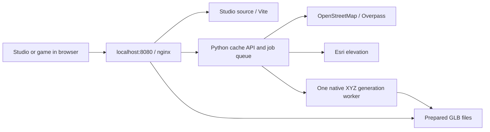

# Local development: Studio, cache and planetary tiles

This is the starting point for running and studying Nabla on your own computer.
The root `compose.dev.yaml` runs the same application source and native XYZ tile
publisher as the hosted demo, with Vite hot reload instead of a static frontend.
It does **not** use the production cache, credentials, or server. Your first visit
to a place generates your own GLBs; subsequent visits reuse them.

## Start here

Install Git and Docker Engine with Compose v2, or Docker Desktop configured for
Linux containers. On Windows, enable Docker Desktop's WSL integration for your
Ubuntu distribution, clone into its Linux home directory, and run these commands
in that distribution. A working `docker version` must show both Client and Server.
You do not need Node or Python installed on the host for this workflow.
On Linux/WSL, if your user ID is not 1000, export `NABLA_DEV_UID=$(id -u)`
and `NABLA_DEV_GID=$(id -g)` before starting; Studio writes files as that user.

Allow roughly 4 GB of free RAM for the stack, additional memory for the browser,
and at least 12 GB of free disk for caches, images and dependencies. The generator
is limited to one CPU and 1.5 GB; it handles one job at a time. Dense places can take
minutes. Internet is needed for initial images/dependencies and uncached provider
data. This is not a download of the whole planet.

```sh
git clone https://github.com/txemavs/nabla-engine.git
cd nabla-engine
docker compose -f compose.dev.yaml up --build -d
docker compose -f compose.dev.yaml logs -f studio world-cache
```

Wait until Vite prints its ready message. Open
[Studio](http://localhost:8080/?studio=desktop). A brief HTTP 502 before Vite
finishes installing dependencies is normal. The default world starts in Irún.
Use [the circuit](http://localhost:8080/?scene=circuit&studio=desktop) for a small
local scene, or [the zoom lab](http://localhost:8080/zoom-lab.html) to inspect tiles.

### Enable your local generator

An initialization service creates a random activation token in a private Docker
volume. It is not in your source checkout or JavaScript bundle. Print your own
activation URL:

```sh
docker compose -f compose.dev.yaml exec world-cache python3 -c "from pathlib import Path; print('http://localhost:8080/?studio=desktop#prepare=' + Path('/secrets/prepare-token').read_text().strip())"
```

Open that URL in your browser once. Studio exchanges the token for an HttpOnly
cookie and removes it from the address bar. Use **localhost**, not a LAN address:
the cookie is Secure, and browsers treat localhost as a local secure exception.
The cookie expires after 30 days; open the same activation URL again to renew it.
Do not share this URL. The stack binds only to `127.0.0.1`.

Before activation you can view already prepared GLBs and the elevation horizon,
but visits cannot enqueue new generation jobs. After activation, visiting a place
queues its required tiles automatically. The footer shows prepared/pending/failed
counts. The first empty cache is slower than the hosted demo's warm cache.

If port 8080 is occupied, set `NABLA_DEV_PORT=8081` in your shell before `up` and
use that port in all browser URLs, including the activation URL.

## What is running?



- **studio:** Node 22, installs the lockfile and serves the bind-mounted source.
  Editing TypeScript/CSS reloads the browser. Its `node_modules` is an isolated
  Docker volume, not your host installation. The service runs as your configured
  development user so build outputs do not become root-owned.
- **world-cache:** the production `Dockerfile.prepare` image. Python serves the
  cache/API and starts the bounded queue worker. The worker invokes the compiled
  Node publisher, then atomically publishes manifests and GLBs.
- **web:** same-origin routing for Vite, `/prepare`, `/world-cache` and `/prepared`.
  No CORS setup or credentials in a frontend build are needed.
- **setup:** a one-shot service that creates the private token and sets volume
  ownership for the non-root generator. Restarts preserve the token and data.

OSM source requests reuse the tile's z13 ancestor. Elevation uses the existing
Esri cache. Provider throttling, retries, retention and job limits still apply.
Other enabled browser features (such as coastlines) can contact their configured
providers; the local stack does not turn third-party services into an offline map.

## Watch and inspect work

```sh
# Services, readiness and resource use
docker compose -f compose.dev.yaml ps
docker compose -f compose.dev.yaml logs -f world-cache
docker stats

# Read-only job table: address, state and attempts
docker compose -f compose.dev.yaml exec world-cache python3 /app/dev-status.py

# Inspect generated files without modifying them
docker compose -f compose.dev.yaml exec world-cache sh -c 'find /publish/z -name manifest.json | head -20'
```

Press Ctrl+C to leave a log-following terminal; the detached services keep running.

While driving in Play mode, **F9** toggles wheel diagnostics: green markers show
physics contacts, orange markers show visual ground hits, and the HUD reports their
height difference. It includes native GLB terrain and accounts for the floating
render origin. Leave it off for ordinary performance measurements: it adds debug
raycasts only while enabled.

Logs report each tile's start, completion time or failure. Inspection opens SQLite
read-only. Do not instantiate `Queue` in an inspection script: its constructor
recovers interrupted jobs and is intended for server startup.

A tile address is globally meaningful: `WebMercatorQuad/15/16218/11999`, stored as
`z/15/16218/11999`. It is not relative to Irún or to a scene origin. The tile size
on the ground depends on zoom and latitude; there is no fixed 1.2 km grid.

Each directory contains `manifest.json`, a `terrain-<hash>.glb` and a separate
`buildings-osm-<hash>.glb`. The manifest records the anchor, bounds, file names,
sizes and hashes. For an address that is ready, open
`http://localhost:8080/prepared/z/15/16218/11999/manifest.json`; use its `files`
entries to download the GLBs. The Studio tile inspector also exposes downloads.
The prepared directory is not a listing of every possible world tile.

Use browser DevTools → Network to distinguish:

| Request                                    | Purpose                                                              |
| ------------------------------------------ | -------------------------------------------------------------------- |
| `/prepare/tiles`                           | Discover ready cells and, when authorized, enqueue missing ones      |
| `/prepare/status`                          | Private generation counters; 401 means this browser is not activated |
| `/prepared/z/.../manifest.json` and `.glb` | Prepared artifacts; only generated cells exist                       |
| `/world-cache/elevation/...`               | Elevation-only horizon while detailed cells are pending              |
| Vite module and WebSocket requests         | Source modules and hot reload                                        |

## Where your work and data live

| Data                                | Storage                                | Lifetime                                                     |
| ----------------------------------- | -------------------------------------- | ------------------------------------------------------------ |
| Code and documentation              | Git checkout                           | Your edits remain on the host                                |
| OSM/elevation responses and queue   | Docker `cache` volume, `/data`         | Survives stop/down; response cache budget 5 GiB              |
| Generated GLBs/manifests            | Docker `prepared` volume, `/publish`   | Survives stop/down; prepared budget 5 GiB, old cells evicted |
| Local preparation token             | Docker `secrets` volume                | Survives stop/down                                           |
| npm packages/cache                  | `dependencies` and `npm-cache` volumes | Reusable and disposable                                      |
| Browser map cache and saved project | Browser storage for `localhost:8080`   | Separate from Docker and from the hosted site                |
| Exported project/scene              | File you save or download              | Keep this as your portable backup                            |

Generated map geometry is replaceable context; authored/customized scene objects
belong to your project. Export projects before clearing browser storage. Changing
host/port creates a different browser-storage origin. Copying GLBs alone does not
copy your project or its portal registry.

```sh
# Stop, preserving data
docker compose -f compose.dev.yaml down

# Start again
docker compose -f compose.dev.yaml up -d

# Copy generated artifacts to the host for inspection/backup
mkdir -p local-backup
docker compose -f compose.dev.yaml cp world-cache:/publish/. ./local-backup/
```

**Destructive reset:** `docker compose -f compose.dev.yaml down -v` deletes this
stack's named volumes, including its token, queue and prepared GLBs. It does not
clear browser storage or delete exported project files. A new start creates a new
token. Back up anything you need first. Never use this command against a production
Compose project.

## Edit and verify

Frontend changes hot-reload. Generator/Python changes require rebuilding:

```sh
docker compose -f compose.dev.yaml up -d --build world-cache

# Same core checks as CI
docker compose -f compose.dev.yaml exec studio npm run check
docker compose -f compose.dev.yaml exec studio npm run build:prepare
docker compose -f compose.dev.yaml exec world-cache sh -c 'CACHE_DIR=/tmp/nabla-tests python3 -m unittest discover -s /app'
```

Browser tests use Playwright's Chromium and system dependencies. Run them on a
supported host/CI with Node 22 (`npm ci`, `npx playwright install --with-deps chromium`,
`npm run test:e2e`); the Alpine Vite container is not a Playwright runner.

Changing generator output requires a corresponding artifact revision/cache
invalidation change. Rebuilding the image alone does not invalidate existing
immutable GLB files. For an isolated experiment, use a disposable development
volume set or deliberately reset your local generated data, preserving projects.

## Reading guide

1. [Architecture](architecture.md): library, editor, simulation and rendering.
2. [Native planetary generation](architecture/native-planet-generation.md): XYZ,
   terrain meshes, GLBs, collisions and the elevation-only horizon.
3. `services/world-cache/server.py`, `queue_store.py`, `prepare_worker.py`:
   cache endpoints, authorization, durable queue and publication loop.
4. `services/world-cache/prepare_planet.py`, `prepare-planet.ts`,
   `planet-geometry.ts`, `planet-batches.ts`: OSM → scene geometry → batched GLBs.
5. `playground/planet-worker.ts`, `planet-world.ts`, `planet-horizon.ts`:
   browser loading, coverage, eviction, collision support and fallback terrain.
6. [Studio projects](studio-projects.md), [planetary world](planetary-world.md)
   and [portals](portals.md): authored objects, world placement and travel.
7. [Performance](performance.md) and [cache operations](world-cache-operations.md):
   budgets, known tradeoffs and the separate server deployment workflow.

## Troubleshooting

- **Docker client only / no Server:** start Docker Desktop, select Linux containers
  and enable WSL integration. `docker version` must work before Compose can work.
- **502 at startup:** follow `logs -f studio`; dependency installation has not yet
  finished, or Vite failed. A healthy cache alone does not mean the UI is ready.
- **Horizon but no roads:** activate local preparation, inspect the queue and wait
  for a tile to become ready. A coarse green horizon is not a completed GLB.
- **Repeated failures:** inspect generator logs, free disk/RAM and provider access.
  Throttled upstream requests back off; repeatedly restarting does not accelerate them.
- **Unexpected old project:** use a fresh browser profile or export your current
  project before deliberately clearing localhost browser storage.
- **Hot reload slow on Windows:** keep the checkout inside the WSL Linux filesystem.
- **Want the hosted cache locally:** this recipe intentionally does not fetch it.
  Your own prepared artifacts can be backed up/restored separately.
