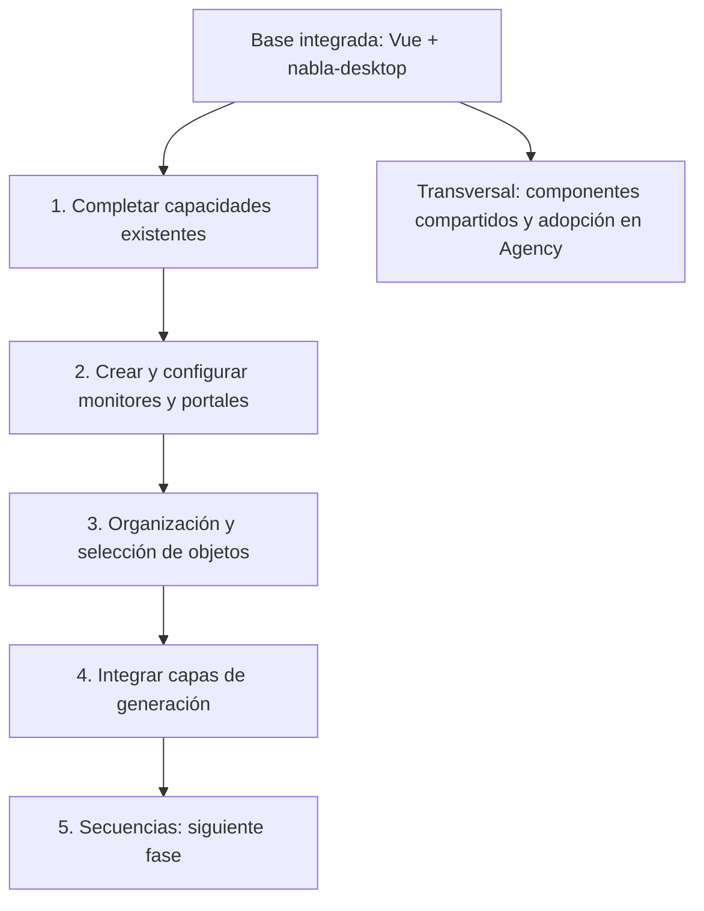

# Próximos pasos de la interfaz de Studio

Estado de cierre: 29 de septiembre de 2026. Esta hoja ordena trabajo pendiente;
no presenta las fases futuras como funcionalidades ya implementadas.

## Cubierto

- Menús y comandos uniformes; paneles con docking y recuperación de distribución.
- Escena como árbol, con vistas Jerarquía y Por clase; propiedades comunes y capacidades.
- Preferencias organizadas; Información como consola; ayuda y controles.
- Edición precisa, historial, bloqueo de ejes y borradores de configuración de vehículos.
- Selección mediante perímetro amarillo y selección de edificios desde su cubierta.
- Ventanas reutilizables con cabecera oscura e iconos monocromos.

## Orden propuesto

1. **Capacidades existentes.** Inventariar las propiedades reales de vehículos,
   barcos, vuelo, OSM, portales y monitores. Completar adaptadores y ventanas con
   Aplicar/Cancelar, validación e historial. No inventar parámetros que el motor
   todavía no tenga. La creación/eliminación de capacidades requiere definir
   compatibilidades; primero configuramos las existentes.
2. **Monitores y portales.** Exponer su creación en Añadir y su configuración desde
   Propiedades. Para monitores, definir plantilla HTML, edición de código,
   entradas de datos y modalidad canvas. Para portales, conexiones y destinos por
   entidad. Preparar escenas pequeñas para probar cada capacidad.
3. **Organización y selección.** Crear grupos y editar la jerarquía conservando
   transformaciones. Después, selección múltiple y por rectángulo. Mantener
   sincronizadas Vista 3D, Escena y Propiedades. Decidir el comportamiento de
   selección de objetos ocultos y qué propiedades se editan en conjunto.
4. **Generación.** Incorporar el contrato de capas del otro proyecto antes de
   diseñar controles definitivos. Mostrar origen, visibilidad, estado y resultados
   de generación sin mezclar entidades editables con capas generadas.
5. **Secuencias.** Reservado para otra fase: definir pistas, tiempo, reproducción
   y relación con la simulación antes de implementar el editor.

## Trabajo transversal

- Convertir progresivamente los controles especializados alojados mediante
  HostContent en componentes/adaptadores; preservar su comportamiento existente.
- Mantener en nabla-desktop únicamente ventanas, árboles, formularios, menús y
  controles genéricos. Studio conserva dominio, capacidades y acciones del motor.
- Preparar la adopción del mismo conjunto de componentes en Agency; evitar una
  segunda implementación y publicar una versión reproducible cuando corresponda.
- Por cada fase, probar guardar/abrir, deshacer/rehacer, entrar/salir de simulación,
  docking, foco de teclado y ventanas. Las pruebas de vehículos y monitores deben
  preservar equipamiento, posiciones y lecturas tras volver al editor.

## Para retomar

Empezar por el inventario de capacidades y una tabla «capacidad → propiedades →
ventana → prueba». Confirmar después el alcance del editor de monitores. No hace
falta rediseñar la distribución general para avanzar en estos dos puntos.
