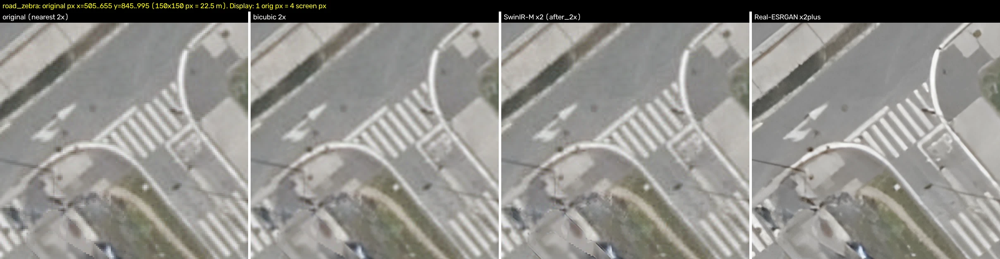
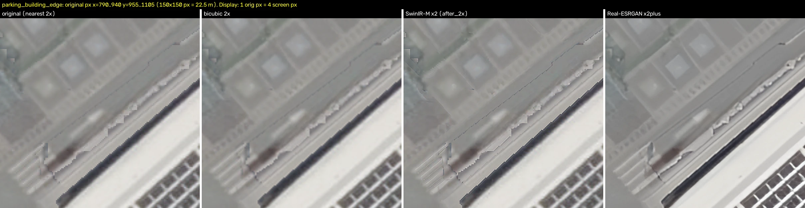

# Ground-texture upscaling (optional stage)

This page records the **optional upscaling stage** of the ground-texture workflow and
the decision taken for it. The stage is **off by default**: it runs only when it is
explicitly enabled (opt-in). With the stage disabled, the workflow is unchanged and
the clean v1 texture goes straight to packaging.

## Decision

Decided by Txema Vicente (project owner) on 2026-09-27. This supersedes the earlier
conclusion that upscaling would not be used.

| Option                    | Status                                    | Reason                                                                                                                                |
| ------------------------- | ----------------------------------------- | ------------------------------------------------------------------------------------------------------------------------------------- |
| **Real-ESRGAN x2plus 2x** | **Chosen** (optional, **off by default**) | The 2x output gains vividness and sharpness. The model repaints part of the texture, but the visual result was reviewed and accepted. |
| SwinIR-M x2               | Discarded                                 | Tested; very faithful to the source, but it does not bring enough visible improvement over the v1 texture.                            |
| Bicubic 2x                | Baseline only                             | Reference for the measurements below; it adds no detail.                                                                              |
| HAT                       | Not tested                                | Its weights are only distributed through Google Drive. Candidate for a future re-evaluation.                                          |

Real-ESRGAN is a generative (GAN) model. Its output is **not** a faithful
reconstruction of the orthophoto: see [Known limitations](#known-limitations). Where
road markings matter, compare the upscaled square against the v1 output before using
it.

## Place in the workflow

```text
geoEuskadi ORTO_2025 orthophoto (CC BY, Eusko Jaurlaritza / Gobierno Vasco)
        │
        ▼
nabla-ways v1 clean texture
  200 m squares, 1333×1333 px (0.15 m/px), EPSG:25830
  vehicles, trees, shadows and walls removed; native road texture and markings kept
        │
        ▼
[optional, off by default] Real-ESRGAN x2plus 2x upscaling
  1333×1333 px → 2666×2666 px (0.0750188 m/px), same EPSG:25830 bbox
        │
        ▼
Chained World factory (txemavs/chained-world, terraform/)
  reproject to EPSG:3857, mosaic, cut z15 cells
        │
        ▼
cell groundImagery in the nabla-planet-tile-v1 manifest.json
  4096 px WebP, about 0.22 m/px
```

- **Input:** a clean v1 square produced by
  [nabla-ways](https://github.com/nabla-veronica/nabla-ways) at tag `v1`.
- **Output:** the same square at twice the linear resolution. The georeference is
  unchanged: same CRS (EPSG:25830) and bbox, pixel size halved. The benchmark run
  wrote both a PNG and a GeoTIFF.
- **Next step:** the Chained World factory reprojects, mosaics and cuts the z15
  cells. Its z15 `groundImagery` (about 0.22 m/px) is coarser than both the v1 square
  (0.15 m/px) and the 2x square (0.075 m/px), so the factory resamples either input.
- **Disabled (default):** the v1 square is handed to the factory as is.

Related engine documentation: the z15 addressing and `manifest.json` layout are
described in [Native planetary tile generation](architecture/native-planet-generation.md);
the geoEuskadi regional data work is in the [geoEuskadi pilot](geoeuskadi-pilot.md).
This repository does not document the nabla-ways pipeline or the Chained World
factory internals.

## How the stage was evaluated

Test date: 27 September 2026.

| Item          | Value                                                                                                                                                       |
| ------------- | ----------------------------------------------------------------------------------------------------------------------------------------------------------- |
| Sample        | One Lechumborro v1 square, bbox EPSG:25830 `595683 4798206 595883 4798406`                                                                                  |
| Scale         | 1333×1333 px (0.15 m/px) → 2666×2666 px (0.0750188 m/px)                                                                                                    |
| Hardware      | NVIDIA GeForce RTX 4090, fp32, 512 px tiles with 32 px overlap (9 tiles)                                                                                    |
| Faithfulness  | Each 2x output was downscaled back to 1333 px (area and Lanczos) and compared with the original v1 square using PSNR and SSIM                               |
| Marking check | Road markings detected as bright, low-saturation, thin pixels within ~15 px of the pipeline's line mask; connected spots counted as appeared or disappeared |

Model weights:

| Model              | Weights file                                 | Source                                                                                                                          | Licence      | SHA-256                                                            |
| ------------------ | -------------------------------------------- | ------------------------------------------------------------------------------------------------------------------------------- | ------------ | ------------------------------------------------------------------ |
| Real-ESRGAN x2plus | `RealESRGAN_x2plus.pth`                      | [Real-ESRGAN v0.2.1 release](https://github.com/xinntao/Real-ESRGAN/releases/download/v0.2.1/RealESRGAN_x2plus.pth)             | BSD-3-Clause | `49fafd45f8fd7aa8d31ab2a22d14d91b536c34494a5cfe31eb5d89c2fa266abb` |
| SwinIR-M x2        | `001_classicalSR_DF2K_s64w8_SwinIR-M_x2.pth` | [SwinIR v0.0 release](https://github.com/JingyunLiang/SwinIR/releases/download/v0.0/001_classicalSR_DF2K_s64w8_SwinIR-M_x2.pth) | Apache-2.0   | `2032ebf8f401dd3ce2fae5f3852117cb72101ec6ed8358faa64c2a3fa09ed4ac` |

### Results

Faithfulness after downscaling the 2x output back to 1333 px (higher is more
faithful to the v1 square):

| Method             | PSNR area (dB) | PSNR Lanczos (dB) | SSIM area | SSIM Lanczos |
| ------------------ | -------------: | ----------------: | --------: | -----------: |
| Bicubic            |         53.309 |            51.933 |   0.99904 |      0.99812 |
| SwinIR-M x2        |         53.410 |            54.751 |   0.99911 |      0.99898 |
| Real-ESRGAN x2plus |         31.458 |            30.630 |   0.95055 |      0.94350 |

Per-pixel absolute difference after area downscaling (8-bit levels):

| Method             |  Mean | p99 | p99.9 | Max | Pixels > 16 | Pixels > 32 |
| ------------------ | ----: | --: | ----: | --: | ----------: | ----------: |
| Bicubic            | 0.341 |   2 |     4 |  17 |       0.00% |       0.00% |
| SwinIR-M x2        | 0.305 |   2 |     6 |  31 |      0.001% |       0.00% |
| Real-ESRGAN x2plus | 4.491 |  34 |    60 |  99 |      3.926% |      1.109% |

Road markings, downscaled output vs the v1 square:

| Method             | Spots appeared | Spots disappeared | Marking overlap (IoU in road area) | Mean brightness shift on marking pixels |
| ------------------ | -------------: | ----------------: | ---------------------------------: | --------------------------------------: |
| Bicubic            |              0 |                 7 |                             0.9619 |                                   0.562 |
| SwinIR-M x2        |              5 |                 0 |                             0.9692 |                                   0.492 |
| Real-ESRGAN x2plus |         **90** |             **4** |                         **0.7611** |                               **9.337** |

The five SwinIR spots are tiny (4–6 px each); none is a new carriageway marking. At
full 2x resolution, compared with bicubic 2x, Real-ESRGAN adds 195 marking-like spots
(overlap 0.7183) and SwinIR adds 30 (overlap 0.9264).

Run time and memory (RTX 4090, fp32, 9 tiles):

| Method                | Model load (s) | Inference cold / warm (s) | Wall, load to PNG (s) | Peak VRAM allocated / reserved (MiB) |
| --------------------- | -------------: | ------------------------: | --------------------: | -----------------------------------: |
| Bicubic (OpenCV, CPU) |              – |                    0.0119 |                     – |                                    – |
| SwinIR-M x2           |          0.299 |           11.520 / 11.199 |                23.383 |                      2932.1 / 3228.0 |
| Real-ESRGAN x2plus    |          0.207 |             0.916 / 0.887 |                 2.381 |                       815.1 / 1396.0 |

The raw evaluation files (`sr_eval.json`, `after_2x_meta.json`) are kept with the
nabla-ways bench outputs (`bench/sr/`). They are not yet published in the
nabla-ways repository.

### Visual comparison

Panels, left to right: original v1 (nearest-neighbour 2x) | bicubic 2x | SwinIR-M x2 |
Real-ESRGAN x2plus. Each crop covers 150×150 original pixels (22.5 m); one original
pixel is displayed as 4 screen pixels.



_Zebra crossing (original px x=505–655, y=845–995). Real-ESRGAN gives crisper stripes
and kerbs and more vivid contrast; bicubic and SwinIR stay close to the soft source._



_Car park and building edge (original px x=790–940, y=955–1105). Real-ESRGAN sharpens
the building edge and roof pattern but smooths away fine ground texture._

## Known limitations

These are measured on the test square above. They are accepted for the optional stage,
not ignored.

- **Repainting.** Real-ESRGAN does not reconstruct the orthophoto; it repaints it.
  Downscaled back to the source size, it scores 31.46 dB PSNR (area) against
  53.31 dB for bicubic, and 3.9% of pixels differ by more than 16 levels.
- **Marking changes.** 90 marking-like spots appeared and 4 disappeared; marking
  overlap with the v1 square drops to 0.761, and marking pixels shift in brightness
  by 9.3 levels on average (0.5 for SwinIR).
- **Fine texture erased.** Low-contrast ground texture (asphalt grain, paving, worn
  surfaces) is smoothed out and replaced with cleaner, flatter surfaces.
- **Not a source of real detail.** The added sharpness is generated, not measured.
  Do not use the upscaled texture for measurement or for reading markings.

**Recommendation:** keep the stage disabled unless it is wanted. Where road markings
matter (crossings, junctions, lane arrows), compare the upscaled square against the
v1 output and prefer v1 if markings are visibly altered.

## Re-evaluation triggers

Re-open this decision if any of the following happens:

- A higher-resolution source orthophoto becomes available.
- A faithful model that adds real detail is available, for example HAT (once its
  weights can be obtained and tested).
- Road markings are visibly corrupted in production imagery.
